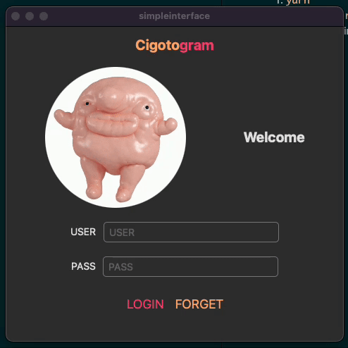

# Taller 1 - Parte 4 - Metodos Numericos

> Prueba pa ver si somos capaces de hacer una interfaz grafica de escritorio 👳‍♂️

## Para correrlo

1. `yarn`
2. `npx react-native run-macos`
3. hasta la proxima 🎊
